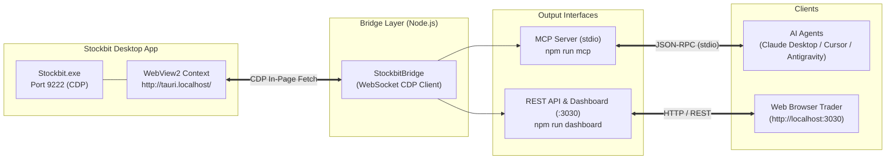

# ⚡ Stockbit Desktop Bridge, MCP Server & Custom Dashboard

> **Jembatan data real-time berbasis Chrome DevTools Protocol (CDP) untuk aplikasi Stockbit Desktop (Tauri v2 + WebView2) yang menghubungkan portofolio & data pasar IDX langsung ke AI Assistant (Claude, Cursor, Antigravity) via Model Context Protocol (MCP) dan antarmuka web dashboard kustom.**

---

## 🌟 Fitur Utama

- 🧠 **AI-Ready via MCP (Model Context Protocol)**: Hubungkan data portofolio, antrean order, dan analisis broker langsung ke AI Assistant untuk evaluasi portofolio, screening emiten, dan bandarmologi.
- 🔒 **Zero-Credential Storage**: Tidak pernah menyimpan password, PIN trading, atau token di file disk. Token sesi aktif dibaca secara aman langsung dari runtime WebView2 saat aplikasi berjalan.
- 📊 **Real-Time Web Dashboard**: Antarmuka visual modern bertema Fintech/Cyberpunk di `http://localhost:3030` yang menampilkan ringkasan modal, floating P&L, holdings, orderbook 10-level, dan bandarmologi top broker.
- 🎯 **Akses Lengkap ke Ekosistem Stockbit**:
  - **Carina API**: Portofolio riil, kas RDN, riwayat & antrean order bursa, sub-account sekuritas.
  - **Exodus API**: Watchlist, orderbook kedalaman pasar, broker summary (akumulasi/distribusi), profil emiten, status sesi IDX.
- 🛡️ **Aman & Read-Only**: Hanya menyediakan akses pembacaan data. Tidak menyediakan fungsi eksekusi order beli/jual otomatis untuk menjamin keamanan dana Anda.

---

## 🏗️ Arsitektur Sistem



Untuk detail teknis mendalam mengenai cara kerja CDP, bypass CORS, dan model keamanan dual-token, baca [Dokumentasi Arsitektur](docs/ARCHITECTURE.md).

---

## 🚀 Panduan Cepat (Quickstart)

### 1. Prasyarat
- **Node.js 18+** terpasang di komputer.
- **Stockbit Desktop v2.2.0+** sudah terpasang ([Download Aplikasi Saham Stockbit Desktop App untuk Mac dan Windows](https://stockbit.com/desktop)).
- Terminal PowerShell / Command Prompt.

### 2. Instalasi Proyek (Otomatis)
```bash
# 1. Clone repository ini
git clone https://github.com/<username>/mcp-stockbit.git
cd mcp-stockbit

# 2. Install dependensi (skrip setup otomatis mendeteksi path lokal Anda)
npm install
```
*(Saat `npm install` berjalan, hook `setup.mjs` akan otomatis mengonfigurasi seluruh file `mcp_config.json` dan mendeteksi instalasi Stockbit di komputer Anda)*.

### 3. Menjalankan Stockbit Desktop (Port 9222)
Aplikasi Stockbit Desktop harus berjalan dengan remote debugging port `9222`:

- **Cara Termudah (Sekali Klik)**: Cukup klik ganda file [launch-stockbit.bat](launch-stockbit.bat). Skrip akan otomatis mendeteksi lokasi `Stockbit.exe` dan menyalakannya dengan parameter debug.
- **Manual (PowerShell / CMD)**:
  ```powershell
  & "C:\Program Files\Stockbit\Stockbit.exe" --remote-debugging-port=9222
  ```
- **Login**: Masuk ke akun Stockbit Anda seperti biasa.

### 4. Uji Koneksi Bridge
Pastikan komunikasi ke Stockbit Desktop berjalan mulus:
```bash
npm test
```
Jika sukses, terminal akan menampilkan nama pengguna Anda, saldo RDN, ringkasan modal, dan orderbook real-time.

### 5. Menjalankan Web Dashboard
- Klik ganda [start-dashboard.bat](start-dashboard.bat) (atau [start-all.bat](start-all.bat) untuk menyalakan keduanya).
- Atau jalankan lewat terminal:
  ```bash
  npm run dashboard
  ```
Dashboard akan otomatis terbuka di browser Anda pada alamat: **`http://localhost:3030`**.

---

## 🤖 Menghubungkan ke AI Assistant (MCP)

Server MCP berjalan melalui transport `stdio`. Tambahkan konfigurasi berikut ke file konfigurasi AI Assistant favorit Anda:

### A. Claude Desktop
Buka `%APPDATA%\Claude\claude_desktop_config.json`:
```json
{
  "mcpServers": {
    "stockbit": {
      "command": "node",
      "args": [
        "C:\\path\\to\\mcp-stockbit\\src\\mcpServer.mjs"
      ]
    }
  }
}
```

### B. Antigravity IDE / Cursor
Gunakan file bawaan [mcp_config.json](mcp_config.json) atau tambahkan di konfigurasi MCP editor:
```json
{
  "mcpServers": {
    "stockbit": {
      "command": "node",
      "args": ["C:/path/to/mcp-stockbit/src/mcpServer.mjs"]
    }
  }
}
```

Panduan integrasi lengkap beserta contoh-contoh prompt interaktif dapat dilihat di [Panduan Integrasi MCP](docs/MCP_SETUP.md).

---

## 🛠️ Daftar Lengkap Tools MCP (45 Tools)

Aplikasi menyediakan **45 enterprise tools** yang dikelompokkan ke dalam 10 modul:

### 1. Akun & Portofolio (Carina API)
| Tool | Kegunaan |
| :--- | :--- |
| `stockbit_get_portfolio` | Saldo kas trading, modal, floating P&L, dan daftar saham yang di-hold. |
| `stockbit_get_bank_account` | Rekening bank RDN dan saldo kas riil. |
| `stockbit_get_portfolio_performance` | Win rate (%), profit factor, realized P&L, total dividen, saham paling aktif. |
| `stockbit_get_portfolio_returns` | Riwayat return kumulatif harian portofolio vs IHSG benchmark. |
| `stockbit_get_sub_accounts` | Rekening sub-account sekuritas (Reguler, Margin, Day Trading). |

### 2. Transaksi & Order Management (Carina API)
| Tool | Kegunaan |
| :--- | :--- |
| `stockbit_get_orders` | Antrean order beli/jual hari ini (Open, Matched, Rejected). |
| `stockbit_get_order_history` | Riwayat transaksi lampau, fee bursa, dividen, dan mutasi saldo. |

### 3. Market Depth & Tape Reading (Exodus API)
| Tool | Kegunaan |
| :--- | :--- |
| `stockbit_get_orderbook` | Kedalaman antrean 10-20 baris Bid/Offer dan jumlah lot. |
| `stockbit_get_tradebook` | Distribusi volume lot per level harga & dominasi buyer vs seller %. |
| `stockbit_get_trade_flow` | Time-series aliran transaksi beli vs jual per menit (**Trade Flow Chart**) & big money. |
| `stockbit_get_running_trade` | Live tape transaksi real-time dengan kode broker buyer/seller & papan NG/RG. |
| `stockbit_get_quote` | Profil emiten ringkas, auto-rejection limit, tick harga terkini. |
| `stockbit_get_market_session` | Status fase jam bursa IDX live (Open, Break, Closed). |

### 4. Bandarmologi & Broker Analytics (Exodus API)
| Tool | Kegunaan |
| :--- | :--- |
| `stockbit_get_broker_summary` | Tabel murni Broker Summary (ranking Top Buyer vs Seller, volume, avg price). |
| `stockbit_get_broker_distribution` | Matrix distribusi broker live (siapa menyerap dari siapa, by value & volume). |
| `stockbit_get_broker_flow` | Aliran dana dan perputaran portofolio broker tertentu ke berbagai saham IDX. |
| `stockbit_get_foreign_flow` | Analisis mendalam arus modal asing (kumulatif Net Foreign, Stance, % partisipasi). |
| `stockbit_get_bandar_detector` | Bandar detector & akumulasi/distribusi **rentang tanggal kustom**. |
| `stockbit_get_broker_activity_historical` | Riwayat akumulasi/distribusi broker tertentu dalam rentang tanggal. |
| `stockbit_get_foreign_domestic_flow` | Rincian arus transaksi Asing vs Domestik (Gross/Net buy/sell). |
| `stockbit_get_broker_list` | Direktori master seluruh kode broker bursa efek IDX. |
| `stockbit_get_top_brokers` | Top broker pembeli dan penjual saham hari ini. |

### 5. Charting & Analisis Teknikal (Exodus API)
| Tool | Kegunaan |
| :--- | :--- |
| `stockbit_get_chartbit` | Candlestick multi-timeframe lengkap: menit (1m-45m), jam (1h-4h), harian, mingguan, bulanan dengan Foreign Flow. |
| `stockbit_get_chart_data` | Candlestick OHLCV harian, volume, Foreign Flow, Frequency Analyzer. |
| `stockbit_get_intraday` | Candlestick intraday 1 menit atau 60 menit. |
| `stockbit_get_historical_data` | Data historis tabular tab **"Historical Data"** (OHLCV, Turnover, Frekuensi, Asing). |
| `stockbit_get_price_performance` | Performa harga multi-timeframe lengkap (1D, 1W, 1M, 3M, 6M, YTD, 1Y s/d 10Y). |

### 6. Fundamental, Rasio & Konsensus Analis (Exodus API)
| Tool | Kegunaan |
| :--- | :--- |
| `stockbit_get_keystats` | Rasio fundamental lengkap terstruktur (Valuasi, Solvabilitas, Profitabilitas). |
| `stockbit_get_keystats_history` | Data deret waktu 10 tahun rasio keuangan emiten (PE/PBV Band). |
| `stockbit_get_seasonality` | Analisis musiman bulanan saham (probabilitas kenaikan & return Jan-Des). |
| `stockbit_get_analyst_consensus` | Target harga konsensus analis sekuritas & rekomendasi Buy/Hold/Sell. |

### 7. Profil Korporat, Insiders & Corporate Actions (Exodus API)
| Tool | Kegunaan |
| :--- | :--- |
| `stockbit_get_company_profile` | Direksi, Komisaris, Pemegang Saham >5%, Anak Perusahaan, Beneficial Owner, IPO. |
| `stockbit_get_insider_transactions` | Transaksi orang dalam (Insider Activity) Direksi & Pemegang Saham Pengendali. |
| `stockbit_get_shareholder_composition` | Struktur kepemilikan saham dari waktu ke waktu. |
| `stockbit_get_corporate_actions` | Kalender aksi korporasi (Dividen, Cum date, DPS, Split, Rights Issue, RUPS). |

### 8. Market Discovery, Screener & Community Stream (Exodus API)
| Tool | Kegunaan |
| :--- | :--- |
| `stockbit_get_market_movers` | Top Gainer, Loser, Most Active, Net Foreign Buy/Sell. |
| `stockbit_get_top_stocks` | Saham dengan perputaran nilai dan transaksi asing terbesar. |
| `stockbit_get_screener_presets` | Katalog preset screener Guru & Teknikal Stockbit. |
| `stockbit_get_stream` | Postingan diskusi & sentimen komunitas trader Stockbit. |
| `stockbit_get_trending` | Saham paling ramai diperbincangkan saat ini. |
| `stockbit_get_watchlist` | Saham dalam watchlist pantauan pengguna. |
| `stockbit_search_emiten` | Pencarian kode saham, nama perusahaan, dan sektor. |

### 9. Fundamental Deep Dive, Financials & Peer Comparison (Exodus API)
| Tool | Kegunaan |
| :--- | :--- |
| `stockbit_get_financials` | Laporan Keuangan lengkap (Laba Rugi, Neraca, Arus Kas) kuartalan/tahunan hingga 74 periode. |
| `stockbit_get_comparison` | Komparasi 66 metrik emiten vs peers kompetitor langsung, industri, dan sektor. |
| `stockbit_get_analysis` | Konsensus analis, potensi kenaikan (upside %), rekomendasi, dan proyeksi keuangan. |

### 10. Alat Tambahan, Notifikasi & Obligasi (Exodus & Carina API)
| Tool | Kegunaan |
| :--- | :--- |
| `stockbit_get_order_queue` | Antrean order transaksi bursa pengguna pada level harga tertentu. |
| `stockbit_get_price_alerts` | Daftar seluruh alarm & pengingat target harga (Price Alerts) aktif. |
| `stockbit_get_chart_layouts` | Template layout chart TradingView Stockbit yang disimpan pengguna. |
| `stockbit_get_bond_portfolio` | Portofolio investasi Obligasi dan Surat Berharga Negara (SBN / Bonds). |
| `stockbit_get_notifications` | Feed notifikasi akun bursa, info dividen, & jumlah notifikasi unread. |

---

## 🛡️ Keamanan & Analisis Risiko Pemblokiran Akun

Banyak pengguna menanyakan mengenai aspek keamanan dana serta apakah terdapat potensi akun diblokir (*banned*) oleh sekuritas/bursa. Berikut penjelasan teknis mendalam:

### 1. Keamanan Dana & Kredensial (100% Aman)
- 🔒 **Read-Only by Design (Hanya Baca)**: Seluruh 45 tools MCP dan endpoint REST dirancang murni untuk membaca data riset pasar dan portofolio. **Tidak ada satupun fitur atau fungsi untuk eksekusi order beli (`BUY`), jual (`SELL`), maupun penarikan dana (`WITHDRAW`)**. Sekalipun model AI mengalami *hallucination*, AI tidak memiliki kapabilitas maupun izin untuk memindahkan dana atau mengubah posisi trading Anda.
- 🔑 **Zero-Credential Storage**: Password, PIN trading bursa, dan token otentikasi **tidak pernah disimpan di media penyimpanan disk** (tidak ada file `.env` atau database kredensial). Sesi dibaca secara dinamis dari RAM/session `window.localStorage` WebView2 saat aplikasi Stockbit Desktop aktif, dan langsung hangus ketika aplikasi ditutup atau di-logout.
- 🌐 **Loopback Isolation (Tersolasi Lokal)**: Port remote debugging `9222` dan Server REST `3030` hanya terikat (*bind*) pada antarmuka jaringan lokal perangkat Anda (`127.0.0.1` / `localhost`). Pihak luar di internet tidak dapat mengakses data Anda tanpa adanya port forwarding manual.

### 2. Apakah Ada Potensi Akun Diblokir?
**Risiko pemblokiran akun secara permanen sangat rendah**, karena arsitektur jembatan ini tidak menggunakan mekanisme bot scraper tradisional (seperti `cURL` atau script HTTP mentah) yang rentan ditandai oleh sistem proteksi WAF/Cloudflare:

- **In-Page Context Evaluation**: Setiap permintaan data dieksekusi via `window.fetch()` langsung dari dalam konteks WebView2 resmi aplikasi Stockbit Desktop.
- **Identik dengan Penggunaan Normal**: Header HTTP, TLS Fingerprint, Origin (`http://tauri.localhost`), Cookie sesi, dan IP Address adalah **100% sama persis** dengan traffic yang dihasilkan saat pengguna sedang mengklik menu atau melihat chart di aplikasi Stockbit Desktop secara manual.

### 3. Matriks Risiko & Mitigasi
| Potensi Risiko | Penyebab Teknis | Dampak & Cara Menghindarinya |
| :--- | :--- | :--- |
| **Rate Limiting (HTTP 429)** | Melakukan polling data secara berlebihan tanpa jeda (misal memanggil orderbook 50x/detik). | **Bukan pemblokiran akun permanen**. WAF hanya membatasi sementara IP selama beberapa menit. **Mitigasi**: Panggil tool secara *on-demand* via AI Assistant atau beri jeda minimal 2–5 detik pada otomatisasi script. |
| **Sesi Kedaluwarsa (HTTP 401)** | Token sesi JWT kedaluwarsa secara berkala oleh server bursa. | Permintaan API gagal. **Mitigasi**: Cukup buka jendela aplikasi Stockbit Desktop dan login ulang. |
| **Terms of Service (ToS)** | Ketentuan umum penyedia platform terkait otomatisasi data. | Penggunaan wajar untuk analisis trading pribadi (bukan scraping massal untuk dijual kembali) berada di luar radar anomali bursa. |

### 4. Panduan Penggunaan Terbaik (Best Practices)
1. **On-Demand Requests**: Panggil tools MCP saat Anda sedang berdiskusi atau meminta evaluasi dari AI Agent (Claude, Cursor, Antigravity).
2. **Gunakan Delay pada Polling**: Jika mengembangkan script otomatisasi pemantau harga, berikan interval wajar (minimal 3–5 detik, jangan per milidetik).
3. **Login Resmi**: Selalu jalankan Stockbit Desktop resmi dan lakukan login manual sebelum menghubungkan server MCP.

---

## 📁 Struktur Direktori Proyek

```
mcp-stockbit/
├── README.md                 # Dokumentasi utama proyek
├── package.json              # Definisi dependensi & script Node.js
├── start-all.bat             # Launcher sekali-klik untuk Stockbit & Dashboard
├── start-dashboard.bat       # Launcher sekali-klik untuk Web Dashboard
├── kill-port.bat             # Utility pembebas port 3030 otomatis
├── mcp_config.json           # Template konfigurasi MCP server
├── test_all_endpoints.mjs    # Automated test suite (56 verification checks)
├── docs/                     # Dokumentasi teknis mendalam
│   ├── MCP_REFERENCE.md      # Referensi lengkap 45 tools MCP & payload JSON
│   ├── ARCHITECTURE.md       # Arsitektur sistem, WebView2, CDP & dual-token
│   ├── API_CATALOG.md        # Katalog lengkap endpoint Carina & Exodus
│   ├── MCP_SETUP.md          # Panduan integrasi Claude, Cursor, Antigravity
│   └── DEVELOPMENT.md        # Panduan pengembangan
├── src/                      # Kode sumber inti
│   ├── stockbitBridge.mjs     # CDP Client WebSocket & API Handler (45+ methods)
│   ├── mcpServer.mjs          # Server MCP (stdio transport, 45 tools)
│   └── server.mjs             # HTTP REST API & Dashboard Server (auto-port kill)
└── dashboard/                 # Frontend Web UI
```

---

## 📚 Indeks Dokumentasi

1. 🤖 **[Referensi Lengkap MCP Tools (`docs/MCP_REFERENCE.md`)](docs/MCP_REFERENCE.md)** — Skema JSON payload setiap tool, parameter, dan panduan untuk AI / App Developer.
2. 🏛️ **[Arsitektur Sistem (`docs/ARCHITECTURE.md`)](docs/ARCHITECTURE.md)** — Cara kerja CDP bridge, bypass CORS, zero-credential storage, dan dual-token model (`at` & `ats`).
3. 📖 **[Katalog API Lengkap (`docs/API_CATALOG.md`)](docs/API_CATALOG.md)** — Daftar lengkap endpoint Carina & Exodus, header standar, parameter, dan contoh response JSON.
4. 🤖 **[Panduan Setup MCP (`docs/MCP_SETUP.md`)](docs/MCP_SETUP.md)** — Langkah menghubungkan ke Claude Desktop, Cursor, Antigravity, serta prompt rekomendasi.
5. 💻 **[Panduan Pengembangan (`docs/DEVELOPMENT.md`)](docs/DEVELOPMENT.md)** — Panduan bagi developer yang ingin menambah tool MCP baru atau endpoint dashboard.

---

## ⚖️ Lisensi & Penafian (Disclaimer)

Proyek ini dibuat untuk tujuan edukasi, riset interoperabilitas data pribadi, dan eksplorasi kecerdasan buatan. Seluruh merek dagang dan hak cipta aplikasi Stockbit dimiliki oleh **PT Stockbit Sekuritas Digital** / **Stockbit**. Pengguna bertanggung jawab penuh atas penggunaan kredensial dan akun masing-masing.
