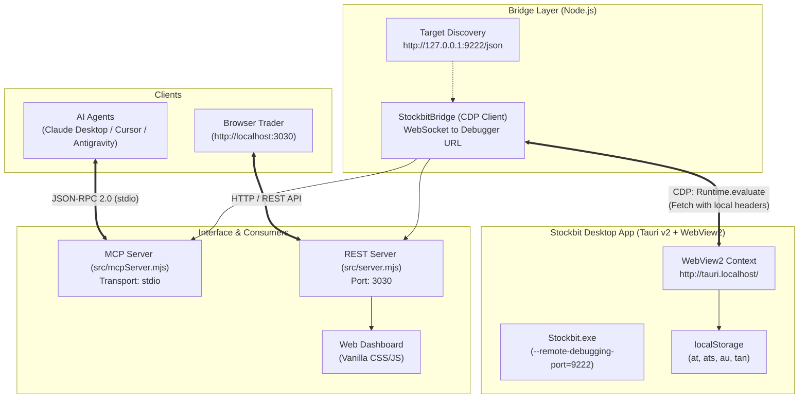

# Arsitektur Sistem: Stockbit Desktop Bridge & MCP Server

Dokumen ini menjelaskan arsitektur teknis, alur data, mekanisme interaksi Chrome DevTools Protocol (CDP), serta model keamanan di balik **Stockbit Desktop Bridge & MCP Server**.

---

## 1. Ikhtisar Arsitektur (High-Level Architecture)

Aplikasi Stockbit Desktop dibangun di atas framework **Tauri v2** yang menggunakan **Microsoft Edge WebView2** (Chromium) sebagai webview runtime di Windows. Proyek ini menghubungkan WebView2 tersebut dengan AI Assistant (melalui MCP) dan Trader UI (melalui Web Dashboard).



---

## 2. Stockbit Desktop & WebView2 Internals

### A. Runtime Environment
- **Framework**: Tauri v2
- **Engine**: Microsoft Edge WebView2 (Chromium Evergreen)
- **Origin Internal**: `http://tauri.localhost/`
- **Session Persistence**: Menggunakan Chromium profile tersimpan di `%LOCALAPPDATA%\Stockbit\`

### B. Remote Debugging Port (`9222`)
Ketika Stockbit Desktop dijalankan dengan argumen:
```powershell
Stockbit.exe --remote-debugging-port=9222
```
Chromium membuka HTTP endpoint internal di `http://127.0.0.1:9222/json` yang memaparkan daftar target WebView yang aktif.

Target utama Stockbit memiliki metadata:
```json
{
  "description": "",
  "devtoolsFrontendUrl": "/devtools/inspector.html?ws=127.0.0.1:9222/devtools/page/...",
  "id": "...",
  "title": "Stockbit",
  "type": "page",
  "url": "http://tauri.localhost/main",
  "webSocketDebuggerUrl": "ws://127.0.0.1:9222/devtools/page/..."
}
```

---

## 3. Mekanisme CDP Bridge (`src/stockbitBridge.mjs`)

Alih-alih melakukan HTTP request mentah dari Node.js yang rentan terblokir oleh mekanisme Cloudflare/WAF Stockbit, Bridge ini menggunakan metode **In-Page Context Evaluation**:

1. **Koneksi WebSocket**: Menghubungi `webSocketDebuggerUrl` target `http://tauri.localhost/main`.
2. **Evaluasi Runtime (`Runtime.evaluate`)**: Mengirimkan perintah JavaScript untuk dieksekusi langsung di dalam konteks origin aplikasi Stockbit.
3. **Pemanfaatan Sesi Alami**:
   - Request API dijalankan via `window.fetch()` di dalam WebView2.
   - Header bawaan Chromium (User-Agent asli, cookie sesi, Origin `http://tauri.localhost`) langsung dikenali dan dipercaya oleh server Stockbit tanpa risiko deteksi bot.

```javascript
// Contoh ringkas eksekusi in-page di stockbitBridge.mjs
const expr = `
  (async () => {
    const tokenRaw = localStorage.getItem('at');
    const token = tokenRaw ? atob(tokenRaw) : '';
    const headers = {
      'Authorization': 'Bearer ' + token,
      'X-Platform': 'desktop',
      'X-AppVersion': '2.2.0',
      'Accept': 'application/json, text/plain, */*'
    };
    const r = await fetch('https://exodus.stockbit.com/watchlist/1234567', { headers });
    return await r.json();
  })()
`;
```

---

## 4. Model Keamanan: Zero-Credential Storage

Prinsip utama dari arsitektur ini adalah **tidak pernah menyimpan password, PIN trading, atau token otentikasi di dalam file disk proyek**.

| Aspek Keamanan | Implementasi |
| :--- | :--- |
| **Penyimpanan Kredensial** | Tidak ada file `.env` atau config yang menyimpan username/password. |
| **Masa Berlaku Token** | Token dibaca secara live dari `localStorage` WebView2 saat request berlangsung. Jika user logout di aplikasi desktop, akses langsung terputus. |
| **Trading Execution** | Bridge ini secara sengaja hanya mengekspos endpoint **Read-Only** (portfolio, watchlist, order status, market data). Tidak ada tool MCP yang mengeksekusi order buy/sell untuk menjamin keamanan dana pengguna. |
| **Akses Lokal** | Port CDP `9222` dan REST Server `3030` hanya terikat pada antarmuka loopback lokal (`127.0.0.1` / `localhost`). |

---

## 5. Dual-Token Architecture

Stockbit memisahkan arsitektur backend menjadi dua domain utama dengan token otentikasi yang berbeda:

```
                  ┌────────────────────────────────────────┐
                  │          Stockbit Desktop App          │
                  │              (WebView2)                │
                  └───────────────────┬────────────────────┘
                                      │
                 ┌────────────────────┴────────────────────┐
                 ▼                                         ▼
       [ Token 'at' (Exodus) ]                  [ Token 'ats' (Carina) ]
                 │                                         │
                 ▼                                         ▼
   ┌───────────────────────────┐             ┌───────────────────────────┐
   │   exodus.stockbit.com     │             │    carina.stockbit.com    │
   ├───────────────────────────┤             ├───────────────────────────┤
   │ - Watchlist               │             │ - Portofolio Saham        │
   │ - Orderbook (Bid/Offer)   │             │ - Saldo RDN & Bank        │
   │ - Broker Distribution     │             │ - Status Order Trading    │
   │ - Info Emiten & Corporate │             │ - Sub-Account Sekuritas   │
   │ - Market Session Status   │             │                           │
   └───────────────────────────┘             └───────────────────────────┘
```

1. **Token `at` (Access Token Umum)**:
   - Format: Base64-encoded JWT (RS256).
   - Domain: `exodus.stockbit.com`.
   - Cakupan: Data riset pasar, watchlist, ringkasan broker, pergerakan harga.
2. **Token `ats` (Access Token Sekuritas)**:
   - Format: Base64-encoded JWT (RS256) bertipe `ACCOUNT_TYPE_EQUITY`.
   - Domain: `carina.stockbit.com`.
   - Cakupan: Transaksi rekening nasabah, kepemilikan aset riil, status order beli/jual di bursa.

---

## 6. Konsumsi Data: MCP Server vs REST Server

Bridge mengekspos data melalui dua saluran paralel:

### A. Model Context Protocol (MCP) (`src/mcpServer.mjs`)
- Menggunakan `@modelcontextprotocol/sdk`.
- Komunikasi via standar I/O (`stdio`).
- AI Agent (Claude, Cursor, Antigravity) memanggil tool dengan format JSON skema Zod dan mendapatkan output terstruktur untuk penalaran finansial kontekstual.

### B. REST API & Web Dashboard (`src/server.mjs`)
- Menggunakan HTTP server Node.js native tanpa dependensi framework berat.
- Menyediakan endpoint REST sederhana (`/api/portfolio`, `/api/watchlist`, `/api/orderbook`, dll.).
- Menyajikan Single Page Application (SPA) dashboard interaktif di port `3030`.
